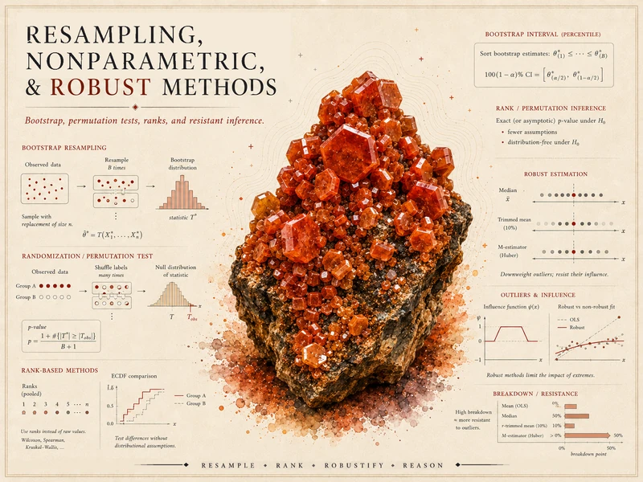

{srcset="assets/hero-web-800.webp 800w, assets/hero-web.webp 1400w" sizes="(min-width: 1200px) 1100px, 92vw" .course-hero-img fig-alt="Course identity hero for Resampling, Nonparametric and Robust Methods — a red-orange vanadinite crystal cluster surrounded by assumption-light graphics including a bootstrap percentile interval, permutation and randomization tests, rank-based methods, robust estimators with a breakdown-point chart, and a method-comparison simulation, with the course title."}

::: {.source-basis}
**Source basis.** Original instructor-authored notes; all data on this site is synthetic and
instructor-generated. Open textbooks are used as *conceptual companions by section title only*
(map-don't-mine) — no prose, figures, examples, or exercises are copied. See
[Open readings & attribution](resources/reading-list.qmd). Public notes are ungraded; **Blackboard is
authoritative** for graded work, due dates, and grades.
:::

# What this course is about {.course-landing-title}

Most statistics courses begin with a comfortable set of models — normal distributions, equal
variances, straight-line regression, the *t*-test, ANOVA, large-sample formulas. Those tools are
genuinely useful. But real data are often **skewed, heavy-tailed, ordinal, small-sample, contaminated
by outliers, or shaped by a design where randomization matters more than a distributional formula.**

This course asks a different opening question:

> **What can we responsibly infer from data when the usual assumptions are shaky, hard to justify, or
> beside the point?**

We treat resampling, ranks, robustness, and simulation not as a box of backup tests to reach for
*after* a normality test fails, but as **core statistical ideas**. You will *see* how methods behave,
name what each one still assumes, choose a method for a purpose, and report results without overselling
them.

## How the site is organized

- **[Notes](notes/index.qmd)** — one page per week. Each leads with a picture and a worked example,
  develops the idea in plain language with live-text math, and ends by connecting the method to a
  data-structure decision. Fifteen weeks, Week 1 → Week 15.
- **[Labs](labs/index.qmd)** — short, self-contained resampling/robustness activities you can run in R
  or Posit Cloud. Public, ungraded exemplars that connect *method logic* to *computation*.
- **[Resources](resources/index.qmd)** — software setup, a cross-cutting method-comparison guide, a
  notation glossary, applied-project guidance, and the open-reading list.

## The habit the course builds

Every topic runs the same loop, on purpose:

**formula → simulation → output → interpretation → method choice.**

You will run simulations, build resampling procedures by hand and in code, compare a parametric and a
nonparametric conclusion on the *same* data, explain a robustness tradeoff, and write a short report
that ties the method you chose to the structure of the data in front of you.

## A note on using AI

AI assistants are allowed as study aids, but resampling and nonparametric methods are unusually easy to
explain *wrong* — by permuting the wrong thing, resampling rows when a dependence structure should be
preserved, treating a bootstrap interval as assumption-free, or claiming a rank method has "no
assumptions." The syllabus asks for a short **AI Use Note** (Tool · Purpose · Verification) on graded
work, and **verification is the load-bearing line.** These public notes are written to give you
something concrete to verify *against*.

------------------------------------------------------------------------

::: {.boundary-note}
This is the **public** course site: notes, labs-as-material, and resources. Graded prompts, rubrics,
point values, answer keys, and due dates live in **Blackboard Ultra**, which governs.
:::
