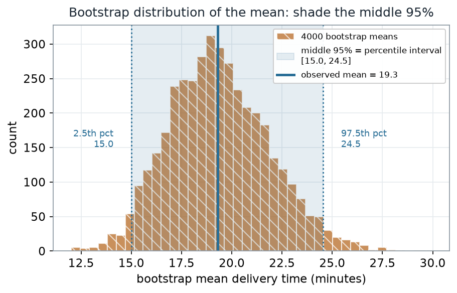
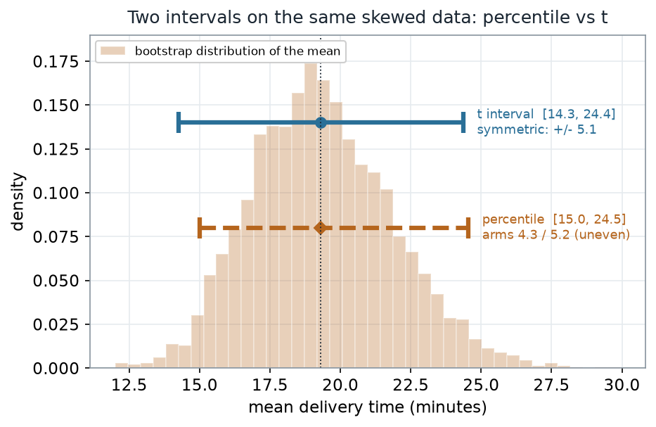
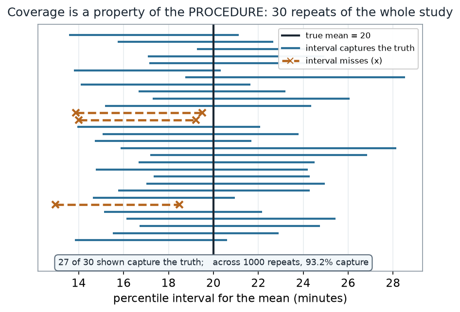

::: {.source-basis}
**Source basis.** Original instructor-authored lab; data is synthetic (45 "food-delivery times" in
minutes, drawn from a fixed generator, seed 45222). Open texts are conceptual companions cited
**by section title only** (map-don't-mine); no prose, figures, examples, or exercises are reproduced.
See [Open readings & attribution](../resources/reading-list.qmd). Ungraded — Blackboard is
authoritative for graded work.
:::

::: {.thisweek}
> **This lab.** Weeks 5–6 built a bootstrap distribution and turned it into a **percentile interval**.
> Here you *do* it: resample one sample with replacement, read the interval off the tails, hold it up
> against the textbook $\bar{x} \pm t\,\text{SE}$ interval, and then stress-test the recipe two ways —
> does it keep its 95% promise across repeated studies, and how many resamples do you actually need
> before the interval you report stops wobbling? Run each block in Posit Cloud, then check your output
> against the target numbers below — the resampling ones are targets to land *near*, not match to the
> last decimal (Step 1 says why).
:::

## Learning goals {#learning_goals}

By the end of this lab you should be able to:

- **Build** a bootstrap distribution of the sample **mean** and read a **percentile interval** off its
  2.5th and 97.5th percentiles.
- **Contrast** the percentile interval with the $\bar{x} \pm t\cdot\text{SE}$ interval and say *why*
  they differ on skewed data.
- **Interpret coverage** as a repeated-sampling property of the *procedure*, not a probability for one
  interval.
- **Separate two kinds of error**: sampling error (fixed by your one sample) from Monte-Carlo error
  (the bootstrap's own noise), and choose $B$ large enough that the second one stops mattering.

## Where we are {#concept_development}

We keep asking the same question: *what is fragile here, and what can we still say?* A single sample
mean is fragile — draw another sample and it moves. The bootstrap measures that movement by
**resampling the sample with replacement**, and a **confidence interval** packages the movement into a
stated range.

Your data is a batch of **45 synthetic food-delivery times** (minutes), right-skewed: a few very long
deliveries pull the tail out to the right. Load it and look before you resample.

```r
# the observed sample (synthetic; 45 delivery times, minutes)
delivery_times <- c(2.2, 4.1, 4.1, 4.4, 4.4, 4.8, 5.8, 5.9, 5.9, 6.9, 7.0, 8.5, 8.6, 9.2,
                    10.4, 11.2, 11.4, 11.8, 11.9, 11.9, 12.1, 12.2, 15.4, 16.1, 16.3, 18.5,
                    20.0, 20.0, 20.1, 20.8, 20.8, 21.9, 23.2, 23.3, 26.1, 27.7, 29.4, 30.8,
                    34.1, 35.0, 36.7, 37.2, 41.1, 73.4, 86.1)
length(delivery_times)          # 45
mean(delivery_times)            # 19.3
sd(delivery_times)              # 16.8
quantile(delivery_times)        # min 2.2, Q1 8.5, median 15.4, Q3 23.3, max 86.1
```

**The sample, as numbers (nonvisual equivalent).**

| Summary | Value (minutes) |
|---|---|
| n | 45 |
| Min · Q1 · Median · Q3 · Max | 2.2 · 8.5 · 15.4 · 23.3 · 86.1 |
| Mean | 19.3 |
| SD | 16.8 |

## Step 1 — Build the percentile interval {#worked_example}

The percentile method is almost embarrassingly simple: resample with replacement, recompute the mean
each time, collect $B$ of those bootstrap means, and read off the **2.5th and 97.5th percentiles**.
Everything between them is the interval — no formula, no normal table, no assumption that the mean is
Normally distributed. The R contains **no plotting**; the picture is downstream.

```r
set.seed(45222)
x    <- delivery_times
B    <- 4000
boot <- replicate(B, mean(sample(x, size = length(x), replace = TRUE)))

quantile(boot, c(0.025, 0.975))   # percentile interval  ->  ~15.0 to 24.5
sd(boot)                          # bootstrap standard error of the mean  ->  ~2.50
```

Your numbers will land *beside* these targets, not exactly on them. The printed values come from
this course's figure generator, whose random-number stream is **not** R's `set.seed(45222)`, so
`sample()` draws a different sequence of resamples. At $B = 4000$ the percentile endpoints are
reproducible only to about a tenth of a minute — so treat `~15.0 to 24.5` as a target to land
near, not a checksum to match. That small gap is exactly the **Monte-Carlo wobble** you will
measure in the last section: it shrinks as $B$ grows, and it is what makes any two seeds disagree
in the last decimal.

::: {#fig-lab02-boot-dist}
{fig-alt="Histogram of 4000 bootstrap means centered near 19.3 minutes; a shaded band marks the middle 95 percent from 15.0 to 24.5, with dotted lines at the 2.5th percentile (15.0) and the 97.5th percentile (24.5) and a solid line at the observed mean 19.3."}

Bootstrap distribution of the mean ($B = 4000$); the shaded band is the percentile interval
$[15.0,\ 24.5]$, with the observed mean at 19.3.
:::

::: {.notice}
**What to notice.** The interval is nothing more than the **middle 95% of the sorted bootstrap means**:
2.5% of the resampled means fall below 15.0 and 2.5% above 24.5. Its edges are two percentiles of a
lightly right-skewed pile, so the upper arm (5.2) runs a little longer than the lower arm (4.3). The
pipeline never assumed a shape — it *read* the shape the resamples produced.
:::

**Percentile read-out (nonvisual equivalent).**

| Quantity | Value |
|---|---|
| Observed mean | 19.3 min |
| Bootstrap SE of the mean | 2.50 min |
| Percentile interval (2.5th, 97.5th) | [15.0, 24.5] |
| Lower arm · upper arm (about the mean) | 4.3 · 5.2 |
| Resamples ($B$) | 4000 |

## Step 2 — Compare with the t interval

The textbook interval is $\bar{x} \pm t_{0.975,\,n-1}\cdot\text{SE}$, with $\text{SE} = s/\sqrt{n}$.
By construction it is **symmetric** — the same distance left and right of $\bar{x}$. The percentile
interval is free to be **asymmetric**, so on skewed data the two disagree.

```r
n  <- length(x)
se <- sd(x) / sqrt(n)
mean(x) + c(-1, 1) * qt(0.975, df = n - 1) * se   # t interval  ->  14.3 to 24.4
```

::: {#fig-lab02-pct-vs-t}
{fig-alt="The bootstrap distribution of the mean drawn faintly, with two horizontal interval bars: a solid teal t interval from 14.3 to 24.4, symmetric about the mean, and a dashed ochre percentile interval from 15.0 to 24.5 with uneven arms 4.3 and 5.2."}

The same skewed data, two intervals: the $t$ interval $[14.3,\ 24.4]$ (symmetric, $\pm 5.1$) and the
percentile interval $[15.0,\ 24.5]$ (asymmetric arms $4.3 / 5.2$).
:::

::: {.notice}
**What to notice.** The $t$ interval reaches down to **14.3** because it is *forced* to be symmetric —
it spends the same 5.1 minutes on each side of $\bar{x}$. The percentile interval only reaches **15.0**
on the low side, because the bootstrap means do not stretch as far left as a symmetric rule assumes.
The percentile method lets the data's shape set the shape of the interval; the $t$ method imposes a
symmetric one. Here the two are close — but the gap widens as skew grows and $n$ shrinks.
:::

**Two intervals side by side (nonvisual equivalent).**

| Interval | Lower | Upper | Half-width / arms | Symmetric? |
|---|---|---|---|---|
| $t$: $\bar{x} \pm t\cdot\text{SE}$ ($t_{0.975,44}=2.0154$) | 14.3 | 24.4 | $\pm 5.1$ | yes |
| Percentile (2.5th, 97.5th) | 15.0 | 24.5 | 4.3 / 5.2 | no |

## Step 3 — Does the interval keep its promise? {#worked_example_coverage}

"95% confidence" is a claim about the **procedure**, not about the one interval you got. Because the
data is synthetic we know the **true mean is exactly 20**, so we can do the experiment you can never do
in practice: repeat the whole study many times and watch the intervals. Each repeat draws a fresh
sample, bootstraps it, and forms a percentile interval; then we count how many capture 20.

```r
# one repeat of the WHOLE study -> a fresh percentile interval (schematic; the picture is downstream)
one_ci <- function() {
  s <- rgamma(45, shape = 2, scale = 10)          # a fresh sample from the known population
  quantile(replicate(1000, mean(sample(s, replace = TRUE))), c(0.025, 0.975))
}
# repeat one_ci() many times and record the share of intervals that contain 20
```

::: {#fig-lab02-coverage}
{fig-alt="Thirty horizontal percentile intervals stacked vertically, each from a fresh simulated sample, with a vertical line at the true mean 20; twenty-seven intervals cross the line (solid, capture) and three miss it (dashed with an x marker)."}

Coverage as a property of the **procedure**: 30 repeats of the whole study. Here 27 of 30 intervals
capture the true mean (20); across 1000 repeats, 93.2% capture.
:::

::: {.notice}
**What to notice.** Every repeat produces a *different* interval, because each starts from a different
sample. "95% confidence" is a promise about the **long-run share that capture the truth**, read off the
*collection* of intervals — not any single one. Notice too that the share came out **93.2%**, a little
short of 95%: for the mean of skewed data at this $n$, the percentile interval mildly **undercovers**.
:::

**Coverage read-out (nonvisual equivalent).**

| Quantity | Value |
|---|---|
| True mean (known, synthetic) | 20 min |
| Repeats simulated | 1000 |
| Intervals capturing the truth | 93.2% |
| Shown in the figure | 27 of 30 capture |

## A common mistake

::: {.misconception}
**"Any number of resamples is fine — bootstrap is bootstrap."** Not quite. There are **two** sources of
error here, and they behave differently. **Sampling error** is baked into your one sample; more
resamples cannot touch it. **Monte-Carlo error** is the bootstrap's *own* randomness — and it shrinks
as you raise $B$. Report an interval from too few resamples and the endpoints you publish are
themselves noisy: rerun with a new seed and they move. The fix is not more data, it is more $B$.
:::

::: {#fig-lab02-too-few-B}
{fig-alt="Interval endpoints plotted against the number of bootstrap resamples on a log-spaced grid of 25, 100, 400, 1600, 6400; recomputed lower endpoints (teal dots) and upper endpoints (ochre x marks) scatter widely at B equals 25 and tighten toward the target lines (lower 14.8, upper 24.5) as B grows."}

The **same** sample, the percentile interval recomputed 200 times at each $B$. At $B = 25$ the lower
endpoint scatters with SD 0.80 min; by $B = 6400$ it settles to SD 0.07 min around the target
$[14.8,\ 24.5]$.
:::

::: {.notice}
**What to notice.** The scatter is pure Monte-Carlo noise: the sample never changed, only the number of
resamples did. At $B = 25$ the reported endpoints wander by nearly a minute; at $B = 6400$ they barely
move. That is why the default $B$ in this course is in the **thousands** — large enough that the
interval you report is the sample's interval, not the random-number generator's.
:::

**Resample-count read-out (nonvisual equivalent).**

| Quantity | Value |
|---|---|
| Recomputes per grid point | 200 |
| Lower-endpoint SD at $B = 25$ | 0.80 min |
| Lower-endpoint SD at $B = 6400$ | 0.07 min |
| Target interval (very large $B$) | [14.8, 24.5] |

## Check your understanding (ungraded)

1. In one sentence, describe how to turn a bootstrap distribution of the mean into a percentile
   interval — what two numbers do you read off, and from what?
2. The percentile interval reached down to 15.0 while the $t$ interval reached 14.3. Explain the
   difference in terms of the **shape** of the bootstrap distribution.
3. A classmate says "the interval $[15.0, 24.5]$ has a 95% chance of containing the mean." Rewrite the
   claim so it is correct, and connect it to the 93.2% you measured.
4. You rerun the bootstrap with a new seed and get $[15.1, 24.3]$ instead of $[15.0, 24.5]$. Which kind
   of error moved the endpoints — sampling or Monte-Carlo — and what single change makes it smaller?

## Reading guide

- **IMS — *Bootstrap confidence intervals*** — a conceptual companion to reading an interval off a
  bootstrap distribution; read for the intuition, then check it against the pictures above.
- **ModernDive — *Bootstrapping and confidence intervals*** — reinforces the percentile method and the
  repeated-sampling meaning of a confidence level.
- **OpenIntro Statistics 4e — *Confidence intervals*** — the $\bar{x}\pm t\cdot\text{SE}$ interval we
  contrast against, for a common reference point.
- **NIST/SEMATECH e-Handbook — *Bootstrap uncertainty*** — an instructor reference on bootstrap
  interval methods and how many resamples they need (cited, not reproduced).

## Accessibility notes

Mathematics is live text ($\bar{x} \pm t\cdot\text{SE}$ renders as MathML, not an image). Every figure
carries an alt line stating its message, a "what to notice" reading, and an adjacent data-summary table,
so each point survives without the picture. Series are distinguished by **linestyle and marker** (solid
= the $t$ interval / a capturing interval / the target-lower line; dashed with an "×" = the percentile
interval / a missing interval; dots vs. × for lower vs. upper endpoints) and by labels, not color alone.
A clean lint and a clean render are evidence; the rendered assistive-technology review is a human step.

## Assessment (descriptive only)

This lab contributes learning evidence toward *constructing and reading a percentile confidence
interval*, *contrasting it with the $t$ interval*, and *separating sampling from Monte-Carlo error*.
That is the **shape** only; the actual graded prompts, weightings, and due dates live in Blackboard.

::: {.boundary-note}
**Public vs. graded.** This is a public, ungraded lab exemplar. Graded lab prompts, keys, rubrics,
point values, and due dates live in **Blackboard Ultra**, which governs.
:::

## Looking ahead

You now have two ways to build an interval — a formula and a resample — plus a clear-eyed view of what
either one claims and how many resamples the second one needs. Lab 3 leaves the mean behind and returns
to **ranks**, building distribution-free procedures for paired and two-sample data where even the
bootstrap's assumptions are more than we want to make.
