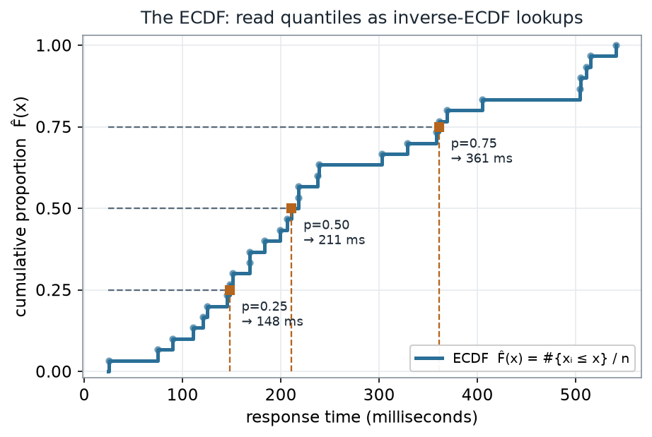
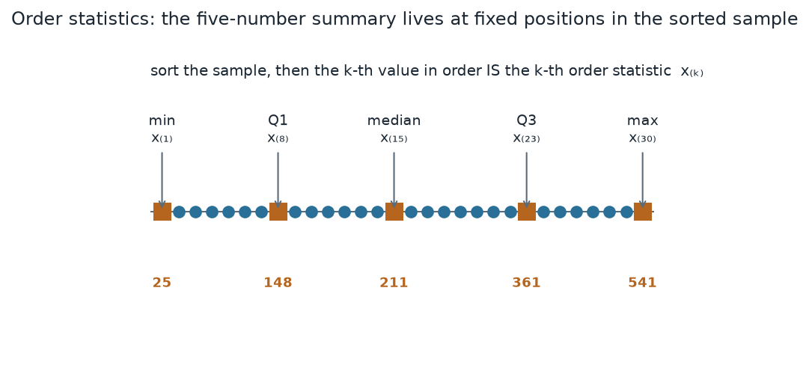
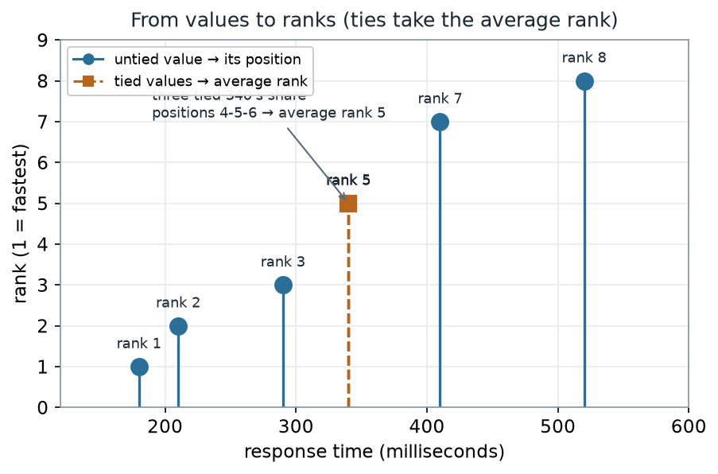
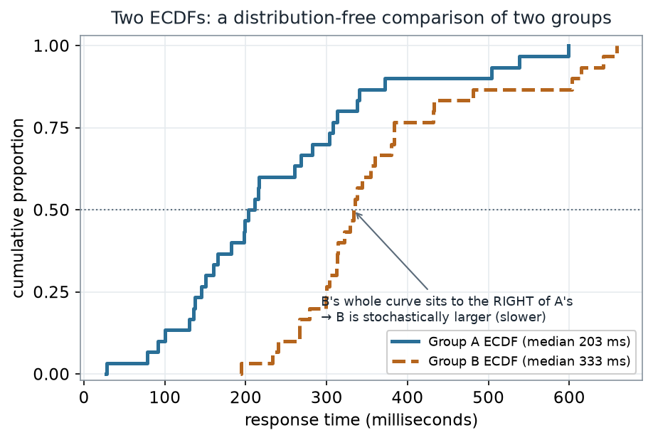
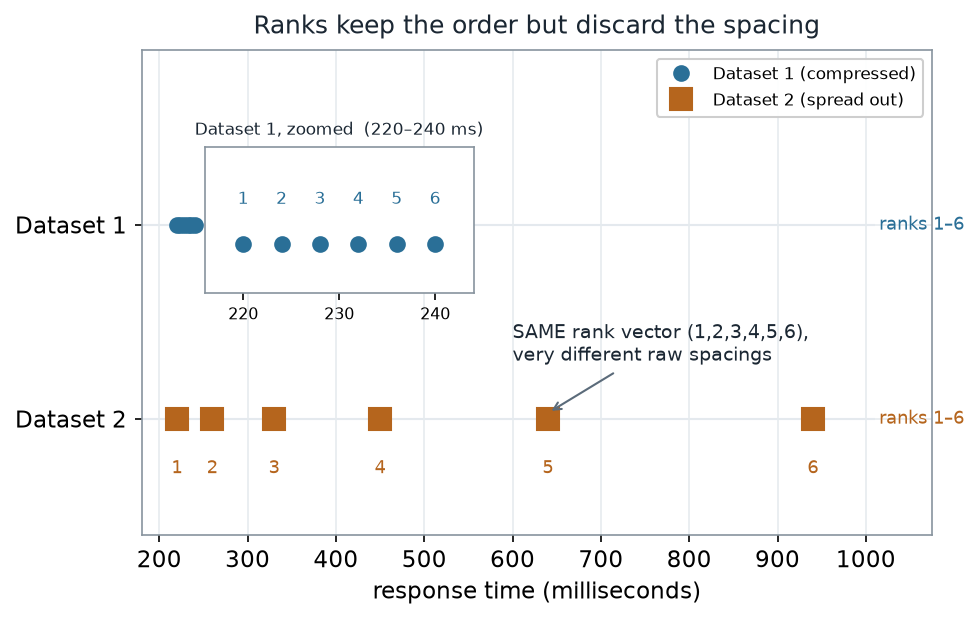

::: {.source-basis}
**Source basis.** Original instructor-authored notes; data is synthetic (30 "response times" in
milliseconds drawn from a fixed generator, seed 45202, plus small demo sets). Open texts are conceptual
companions cited **by section title only** (map-don't-mine); no prose, figures, examples, or exercises are
reproduced. See [Open readings & attribution](../resources/reading-list.qmd). Ungraded — Blackboard is
authoritative for graded work.
:::

::: {.thisweek}
> **This week.** Last week we asked *what is fragile here?* and saw the mean and SD get dragged around by a
> single point. Before we resample or test anything, we need a description toolkit that does **not** lean on
> a distributional shape. Three objects give us exactly that — the **empirical CDF**, the **order
> statistics**, and the **ranks**. Every rank test, every quantile, and every distribution-free comparison
> in this course is built out of these three. Get them solid now and the rest of the semester is assembly.
:::

## Learning goals {#learning_goals}

By the end of this week you should be able to:

- Define and read the **empirical CDF** $\hat F(x) = \#\{x_i \le x\}/n$, and use it to look up quantiles as
  **inverse-ECDF** lookups.
- Identify the **order statistics** $x_{(1)} \le \dots \le x_{(n)}$ and locate the five-number summary at
  fixed positions in the sorted sample.
- Convert values to **ranks**, handling **ties by averaging**, and say why ranks are the raw material of
  the rank tests to come.
- Compare two groups with **overlaid ECDFs** and read **stochastic ordering** off the picture — no Normal
  assumption required.
- Explain what ranks **keep** (order) and what they **discard** (spacing).

## Where we are {#concept_development}

A histogram bins the data and throws away the exact values; a mean collapses everything to one number. The
**empirical CDF** does neither. It is the sample's own distribution function: at each value $x$ it reports
the proportion of observations at or below $x$,
$$\hat F(x) = \frac{\#\{x_i \le x\}}{n}.$$
It is a **step function** that starts at 0, jumps by $1/n$ at every observation, and ends at 1. Nothing is
assumed about the population — $\hat F$ is a complete, lossless summary of the sample, and every quantile we
will ever read is read off it.

::: {#fig-w02-ecdf}
{fig-alt="Empirical CDF step function of 30 response times rising from 0 to 1; dashed horizontal guides at heights 0.25, 0.50, and 0.75 meet the curve and drop to the x-axis at 148, 211, and 361 milliseconds, marking Q1, the median, and Q3 as inverse-ECDF lookups."}

The ECDF of 30 synthetic response times. To read a quantile, enter at a height $p$ on the left, go right to
the curve, and drop down: the 0.25 / 0.50 / 0.75 heights land at **148 / 211 / 361 ms**.
:::

::: {.notice}
**What to notice.** A quantile is just an **inverse-ECDF lookup**. Because the curve is a step function, a
height like 0.25 is reached at the first value whose cumulative proportion is *at least* 0.25 — here
$8/30 = 0.267$, so the 0.25-quantile is the 8th sorted value. There is no smoothing and no distribution to
fit; the median (211 ms) is simply where the curve first reaches height 0.50.
:::

**The ECDF read-off (nonvisual equivalent).**

| Height $p$ | First cumulative proportion $\ge p$ | Quantile (ms) |
|---|---|---|
| 0.25 | $8/30 = 0.267$ | $Q_1 = 148$ |
| 0.50 | $15/30 = 0.500$ | median $= 211$ |
| 0.75 | $23/30 = 0.767$ | $Q_3 = 361$ |

### Order statistics: the sorted sample

Those look-ups landed on the **8th**, **15th**, and **23rd** values *in sorted order*. Sorting the sample
turns it into its **order statistics** $x_{(1)} \le x_{(2)} \le \dots \le x_{(n)}$, where $x_{(k)}$ is simply
the $k$-th smallest value. Once sorted, the five-number summary lives at fixed positions and needs no
formula beyond counting.

::: {#fig-w02-order-stats}
{fig-alt="A horizontal strip of 30 dots for the sorted sample; five are highlighted as squares and labeled min x(1)=25, Q1 x(8)=148, median x(15)=211, Q3 x(23)=361, and max x(30)=541."}

The sorted sample as order statistics. The five-number summary sits at fixed positions:
$x_{(1)}=25$, $x_{(8)}=148$, $x_{(15)}=211$, $x_{(23)}=361$, $x_{(30)}=541$ (ms).
:::

::: {.notice}
**What to notice.** The min, quartiles, median, and max are not special formulas — they are **particular
order statistics**. The whole apparatus of "position in the sorted list" is what makes these summaries
distribution-free: reorder the world however you like, $x_{(15)}$ is still the 15th smallest value.
:::

**Five-number summary as order statistics (nonvisual equivalent).**

| Summary | Order statistic | Value (ms) |
|---|---|---|
| Minimum | $x_{(1)}$ | 25 |
| $Q_1$ | $x_{(8)}$ | 148 |
| Median | $x_{(15)}$ | 211 |
| $Q_3$ | $x_{(23)}$ | 361 |
| Maximum | $x_{(30)}$ | 541 |

## Worked example — reading quantiles off the ECDF {#worked_example}

The R you would run is short, and notice there is **no plotting** in it — the picture above is downstream:

```r
# Schematic: the named data objects are the sample(s) described in the text above; this illustrates the analysis, not a self-contained runnable block.
# read quantiles as inverse-ECDF lookups; no plotting here
x    <- response_times                       # the 30 observed values (ms)
Fhat <- ecdf(x)                              # the empirical CDF, a step function
sort(x)[c(8, 15, 23)]                        # Q1, median, Q3 as order statistics x_(8), x_(15), x_(23)
quantile(x, c(.25, .5, .75), type = 1)       # the SAME values, as inverse-ECDF (type-1) quantiles
```

Both lines return **148, 211, 361**. The second line names the convention explicitly: `type = 1` is the
inverse of the ECDF — the smallest value whose cumulative proportion reaches $p$. Other software defaults
(R's `type = 7`, for instance) interpolate *between* order statistics and can give slightly different
numbers; when you compare tools, state which quantile definition you used.

## Ranks: replace each value by its position

Ranks push the order-statistic idea one step further: instead of keeping the values, keep only **where each
value falls in the sorted order**. The smallest gets rank 1, the next rank 2, and so on. The one wrinkle is
**ties**: when several observations are equal, they cannot each claim a different position, so each gets the
**average** of the positions they jointly occupy.

::: {#fig-w02-ranks}
{fig-alt="A lollipop plot of eight demo response times against their ranks; three tied values of 340 milliseconds share positions 4, 5, and 6 and are drawn as dashed ochre stems all at rank 5, while the untied values sit at ranks 1, 2, 3, 7, and 8."}

Eight demo values mapped to ranks. The three tied **340 ms** values occupy positions 4, 5, 6 and each
takes the **average rank 5**; the untied values keep ranks 1, 2, 3, 7, 8.
:::

::: {.notice}
**What to notice.** Ties are resolved by averaging, not by breaking ties arbitrarily: $(4+5+6)/3 = 5$. This
keeps the sum of ranks fixed at $1+2+\dots+n$ no matter how many ties occur, which is exactly the property
the rank tests in Weeks 7–8 rely on.
:::

**Values to ranks, with a tie (nonvisual equivalent).**

| Sorted value (ms) | 180 | 210 | 290 | 340 | 340 | 340 | 410 | 520 |
|---|---|---|---|---|---|---|---|---|
| Position | 1 | 2 | 3 | 4 | 5 | 6 | 7 | 8 |
| Rank (average ties) | 1 | 2 | 3 | 5 | 5 | 5 | 7 | 8 |

## Worked example — from values to ranks

```r
# Schematic: the named data objects are the sample(s) described in the text above; this illustrates the analysis, not a self-contained runnable block.
# ranks with the default average-ties rule; no plotting here
demo <- c(210, 340, 340, 180, 520, 410, 290, 340)
rank(demo)                                   # ties.method = "average" is R's default
#  -> 2 5 5 1 8 7 3 5   (the three 340's each become (4+5+6)/3 = 5)
```

`rank()` returns the ranks *in the original order* of the data, so the three 340's — the 2nd, 3rd, and 8th
entries of `demo` — all come back as **5**. Everything downstream (rank sums, signed ranks) is arithmetic on
this vector.

## Comparing two groups without a model

Because the ECDF assumes nothing about shape, we can lay two groups' ECDFs on the same axes and compare them
**distribution-free**. If one curve sits entirely to the right of the other, that group tends to produce
larger values — it is **stochastically larger**.

::: {#fig-w02-two-ecdf}
{fig-alt="Two empirical CDF step functions on one axis; Group A in solid teal with median 203 milliseconds rises earlier, and Group B in dashed ochre with median 333 milliseconds sits entirely to its right, indicating Group B is stochastically larger."}

Group A (solid, median 203 ms) versus Group B (dashed, median 333 ms). Group B's whole curve lies to the
right of A's, so Group B is **stochastically larger** — a model-free statement of "slower".
:::

::: {.notice}
**What to notice.** We did not assume Normality, equal variance, or even a specific shape. "B is to the
right of A" is a statement about *whole distributions*. It is this **right-shift** — the whole B curve
sitting to the right, equivalently the **area between the two ECDFs** (how often a Group B value lands above
a Group A value) — that seeds the two-sample **rank-sum / Mann-Whitney** methods in Week 8. A *different*
summary, the largest vertical gap between the two curves (here about **0.57**), is the two-sample
**Kolmogorov-Smirnov** statistic — a distinct EDF-based test we do not meet in Week 8, so keep the two apart.
:::

**Two-group comparison (nonvisual equivalent).**

| Group | Median (ms) | Position relative to the other |
|---|---|---|
| A | 203 | ECDF to the left (smaller values) |
| B | 333 | ECDF entirely to the right (stochastically larger) |
| Both | — | max vertical ECDF gap $\approx 0.57$ (two-sample Kolmogorov-Smirnov statistic, not the Week 8 rank test) |

## A common mistake

::: {.misconception}
**"Ranks capture the data, so I can throw the raw values away."** Ranks capture the **order** and nothing
else. Two datasets can have the **identical** rank vector while their raw values are spaced completely
differently — one tightly clustered, the other stretched across a huge range. Any conclusion that depends on
*how far apart* the values are (a mean difference, an effect size in real units) is invisible to ranks.
Rank methods trade that information away on purpose in exchange for robustness; that trade is a choice, not
a free lunch.
:::

::: {#fig-w02-ranks-lose-spacing}
{fig-alt="Two rows of points sharing the rank vector 1 through 6; Dataset 1 is clustered between 220 and 240 milliseconds (shown enlarged in an inset), while Dataset 2 spreads from 220 to 940 milliseconds, yet both carry the same ranks."}

Two datasets with the **same** rank vector $(1,2,3,4,5,6)$. Dataset 1 spans just **20 ms** (220–240);
Dataset 2 spans **720 ms** (220–940). Identical ranks, wildly different spacings.
:::

::: {.notice}
**What to notice.** Both rows produce exactly $(1,2,3,4,5,6)$, so any rank-based summary treats them as
identical — yet Dataset 2's range is **36×** wider than Dataset 1's. Ranks answer "which is bigger?", never
"by how much?"
:::

**Same ranks, different spacing (nonvisual equivalent).**

| Dataset | Values (ms) | Rank vector | Range (ms) |
|---|---|---|---|
| 1 (compressed) | 220, 224, 228, 232, 236, 240 | 1, 2, 3, 4, 5, 6 | 20 |
| 2 (spread out) | 220, 260, 330, 450, 640, 940 | 1, 2, 3, 4, 5, 6 | 720 |

## Check your understanding (ungraded)

1. Explain in one sentence why $\hat F(x)$ is a **step** function and why every jump has the same height.
2. Using the inverse-ECDF rule, which order statistic is the 0.90-quantile of a sample of $n=30$? (Give the
   subscript $x_{(k)}$.)
3. A sample has four observations equal to 12, and they occupy positions 5, 6, 7, 8 in sorted order. What
   average rank does each receive, and why does averaging keep the total rank sum unchanged?
4. Two ECDFs cross each other (neither is entirely to the right). Can you still say one group is
   stochastically larger? What would you report instead?
5. Give one real question the **ranks** of a dataset can answer and one they **cannot**.

## Reading guide

- **OpenIntro Statistics 4e — *Examining numerical data*** — a companion for quantiles and the five-number
  summary; read for intuition, then check it against the ECDF picture above.
- **IMS — *Exploring numerical data*** — reinforces distributions and quantiles as descriptive objects.
- **NIST/SEMATECH e-Handbook — *Empirical Distribution Function; Percentiles*** — a reference for the ECDF
  definition and for how percentile conventions differ (the `type` issue).
- **Learning Statistics with R (Navarro) — *Descriptive statistics*** — an R-oriented reference for
  percentiles and `rank()` (cited, not reproduced).

## Accessibility notes

Mathematics is live text ($\hat F(x) = \#\{x_i \le x\}/n$ renders as MathML, not an image). Every figure
carries an alt line stating its message, a "what to notice" reading, and an adjacent data-summary table, so
each point survives without the picture. Series are distinguished by **linestyle and marker** (solid circle
= observed/untied, dashed square = second group/tied) plus value-bearing labels, never color alone. A clean
lint and a clean render are evidence; the rendered assistive-technology review is a human step.

## Assessment (descriptive only)

This week contributes learning evidence toward *reading an ECDF and its quantiles*, *working with order
statistics and ranks*, and *making a distribution-free two-group comparison*. That is the **shape** only;
the actual graded prompts, points, and due dates live in Blackboard.

::: {.boundary-note}
**Public vs. graded.** These are public, ungraded notes and practice. Graded prompts, keys, rubrics, point
values, and due dates live in **Blackboard Ultra**, which governs.
:::

## Looking ahead

Next week we put these objects to work. The ranks and order statistics you built here become the currency of
**resampling-based tests**: we hold the pooled values fixed, shuffle the group labels, and let the ECDF-style
comparison you just met turn into a **permutation** *p*-value.
