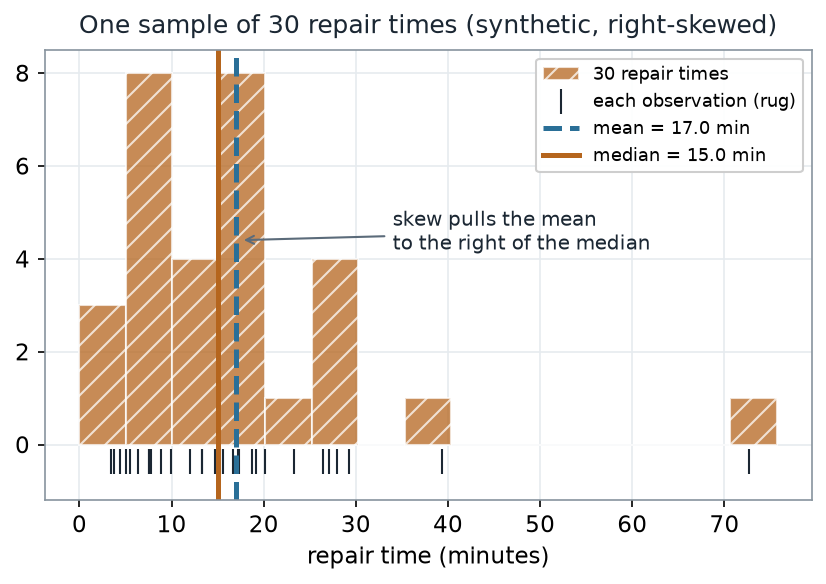
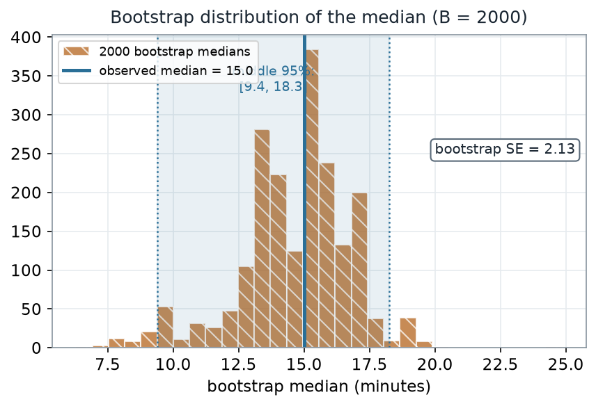
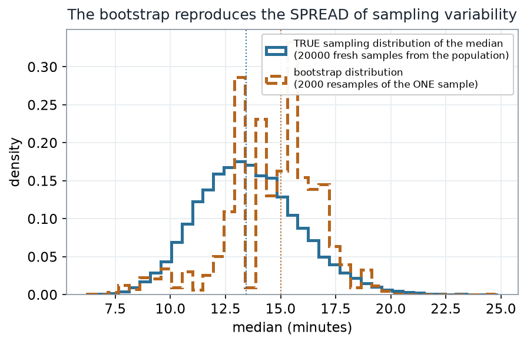

::: {.source-basis}
**Source basis.** Original instructor-authored notes; data is synthetic (30 "repair times" drawn from a
fixed generator, seed 45205). Open texts are conceptual companions cited **by section title only**
(map-don't-mine); no prose, figures, examples, or exercises are reproduced. See
[Open readings & attribution](../resources/reading-list.qmd). Ungraded — Blackboard is authoritative for
graded work.
:::

::: {.thisweek}
> **This week.** Last week we produced a *p*-value by simulating what the data *could* have looked like
> under a null. This week we ask a different question about a single sample: **how much would our
> summary have wobbled if we had drawn a different sample?** The bootstrap answers it by treating the
> sample as a stand-in for the population and *resampling from the sample itself.*
:::

## Learning goals {#learning_goals}

By the end of this week you should be able to:

- Explain what **resampling with replacement** does, and why a bootstrap distribution approximates
  sampling variability.
- Build a **bootstrap distribution** of a statistic (here, the median) and read its **spread** and a
  **percentile interval**.
- Keep three things distinct: the **data**, the **bootstrap distribution**, and the (usually unseen)
  **true sampling distribution**.
- State what the bootstrap **assumes** — and name a statistic for which it **fails**.

## Where we are {#concept_development}

We keep returning to one question: *what is fragile here, and what can we still say?* A single number
like a sample median is fragile in a specific way — draw a different sample and you would get a
different median. Ordinarily we never see that variability, because we only have **one** sample.

The bootstrap's move is almost cheeky: if the sample is our best picture of the population, then
**drawing new samples from the sample** (with replacement, same size) imitates drawing new samples from
the population. Each resample gives a new value of the statistic; the collection of those values is the
**bootstrap distribution**, and its spread estimates how much the statistic wobbles.

### The sample we will resample

Our running example is a batch of **30 repair times** (minutes), synthetic and right-skewed. Because the
data is skewed, the **mean is pulled to the right of the median** — so the median is the steadier
summary, and it is the one we will bootstrap.

::: {#fig-w05-data-skew}
{fig-alt="Histogram of 30 right-skewed repair times with a rug of individual points; a dashed vertical line marks the mean at 17.0 minutes and a solid vertical line marks the median at 15.0 minutes, with the mean sitting to the right of the median."}

One sample of 30 synthetic repair times; right-skewed, with the mean (17.0) pulled to the right of the
median (15.0).
:::

::: {.notice}
**What to notice.** The sample is right-skewed, so the mean (17.0 min) sits above the median (15.0 min). A handful of long
repairs drag the mean up; the median barely moves. That resistance is exactly why we summarize this
sample with the **median**.
:::

**The sample, as numbers (nonvisual equivalent).**

| Summary | Value (minutes) |
|---|---|
| n | 30 |
| Min · Q1 · Median · Q3 · Max | 3.4 · 7.6 · 15.0 · 19.9 · 72.7 |
| Mean | 17.0 |

## How one bootstrap resample works

A single bootstrap resample is one mechanical move: **draw a sample of the same size from the observed
values, with replacement.** Some values get picked more than once; others get left out.

::: {#fig-w05-resample-mechanics}
{fig-alt="Schematic: a top row of eight sample values (7, 9, 12, 12, 15, 18, 24, 31), an arrow labeled 'draw 8 with replacement', and a bottom row showing one resample (7, 12, 12, 12, 18, 18, 24, 31) in which 12 and 18 repeat and 9 is omitted; the resample median is 15."}

One bootstrap resample of a small 8-value demo sample: draw 8 values *with replacement*, then recompute
the statistic. Here 12 and 18 repeat, 9 is omitted, and the resample median is 15.
:::

::: {.notice}
**What to notice.** The bootstrap samples **from the sample**, not from the population. Value 9 dropped out of this
resample; 12 and 18 repeat (12 three times, 18 twice). Repeat this thousands of times, recomputing the statistic each time,
and the spread of those recomputed values is the bootstrap distribution.

**The demo, as numbers.** Original sample `7, 9, 12, 12, 15, 18, 24, 31` → one resample
`7, 12, 12, 12, 18, 18, 24, 31` → resample median `15`.
:::

The R you would run is short — and notice there is **no plotting** in it; the picture is downstream:

```r
# Schematic: the named data objects are the sample(s) described in the text above; this illustrates the analysis, not a self-contained runnable block.
# resample the sample, with replacement, and recompute the statistic
set.seed(45205)
x   <- repair_times            # the 30 observed values
B   <- 2000
med <- replicate(B, median(sample(x, size = length(x), replace = TRUE)))

sd(med)                        # bootstrap standard error of the median
quantile(med, c(0.025, 0.975)) # a 95% percentile interval (Week 6 builds on this)
```

## Worked example — bootstrapping the median {#worked_example}

Running the resampling above 2000 times gives a **bootstrap distribution of the median**.

::: {#fig-w05-boot-median}
{fig-alt="Histogram of 2000 bootstrap medians centered near 15 minutes, with a solid line at the observed median 15.0 and a shaded band marking the middle 95 percent from 9.4 to 18.3; the bootstrap standard error is about 2.1."}

Bootstrap distribution of the median from 2000 resamples. Bootstrap SE ≈ 2.1 min; middle 95% ≈
[9.4, 18.3].
:::

::: {.notice}
**What to notice.** The **width** of this distribution is the point. The observed median (15.0) is not exact — resampling
shows it would plausibly have landed anywhere across roughly 9 to 18 minutes. The standard deviation of
the bootstrap medians, about **2.1 minutes**, is the **bootstrap standard error** of the median.
:::

**Bootstrap read-out (nonvisual equivalent).**

| Quantity | Value |
|---|---|
| Observed median | 15.0 min |
| Bootstrap SE of the median | 2.13 min |
| Middle 95% (percentile) | [9.4, 18.3] min |
| Resamples (B) | 2000 |

## What the bootstrap is really doing

Here is the honest question: does that bootstrap distribution actually match the **true** sampling
variability of the median? Because our data is synthetic, we know the population, so for once we can draw
the *true* sampling distribution (take 20,000 fresh samples of 30 from the population and take each
median) and lay it beside the bootstrap.

::: {#fig-w05-boot-vs-sampling}
{fig-alt="Two overlaid step histograms of the median. A solid curve is the true sampling distribution centered near 13.4 minutes; a dashed curve is the bootstrap distribution centered near 15.0 minutes. The two curves have similar width but different centers."}

The bootstrap distribution (dashed) vs the true sampling distribution (solid): **similar spread**, but
the bootstrap is centered at the **sample** median (15.0), not the true median (13.4).
:::

::: {.notice}
**What to notice.** Similar **width**, different **center**. The bootstrap reproduces the *spread* of sampling variability
remarkably well from a single sample — bootstrap SE 2.13 vs the true sampling SE 2.31. But it is
centered where the sample happened to land (15.0), not at the truth (13.4). **The bootstrap estimates
variability, not the parameter.** If your one sample is off-center, so is your bootstrap.
:::

**Spread vs center (nonvisual equivalent).**

| Distribution | Center | SE (spread) |
|---|---|---|
| True sampling distribution of the median | ≈ 13.4 (true) | 2.31 |
| Bootstrap distribution (from the one sample) | 15.0 (observed) | 2.13 |

## A common mistake

::: {.misconception}
**"Nonparametric and resampling-based, so the bootstrap has no assumptions."** It has real ones. It
assumes your sample is a fair stand-in for the population and that observations are independent — and it
leans on the sample being large enough to carry the shape you need. When those slip, so does the
bootstrap. The clearest failure is an **extreme order statistic** like the maximum.
:::

## Worked example — where the bootstrap fails

Bootstrap the **maximum** of the same 30 values instead of the median, and compare again to the truth.

::: {#fig-w05-boot-max-fails}
{fig-alt="A smooth solid curve for the true sampling distribution of the maximum beside tall discrete hatched bars for the bootstrap distribution of the maximum, which are capped at the observed max of 72.7 minutes with about 63 percent of the mass on that single value."}

Bootstrap distribution of the maximum (hatched bars, capped at the observed max 72.7) vs its smooth true
sampling distribution (solid). The bootstrap fails badly here.
:::

::: {.notice}
**What to notice.** A resample can only reuse values you already have, so its maximum **can never exceed the observed
maximum (72.7)** — and about **63%** of resamples hit that value exactly (that is
$1 - (1 - 1/n)^n \approx 0.63$ for $n = 30$). The result is a lumpy, capped distribution that misses the
smooth truth entirely. The bootstrap is a tool with a domain, not a universal solvent.
:::

**Failure read-out (nonvisual equivalent).**

| Quantity | Value |
|---|---|
| Observed maximum | 72.7 min |
| Share of resamples whose max **equals** the observed max | 0.63 |
| Can a bootstrap max exceed 72.7? | No |

## Check your understanding (ungraded)

1. In your own words, what is the bootstrap sampling *from*, and why must a resample be the **same size**
   as the original sample?
2. The bootstrap SE of the median came out near 2.1 minutes. What real-world quantity is that number an
   estimate *of*?
3. The bootstrap distribution of the median matched the true one's **spread** but not its **center**.
   Explain why, and what that means for how much you should trust the observed median as the "answer."
4. Give one reason the bootstrap of the **maximum** failed, and name one other statistic you would be
   cautious bootstrapping.

## Reading guide

- **IMS — *Bootstrapping*** — a conceptual companion to the resample-with-replacement idea; read for the
  intuition, then verify it against the picture above.
- **OpenIntro Statistics 4e — foundations for inference** — reinforces sampling variability as the thing
  the bootstrap approximates.
- **Hesterberg (2015), *What Teachers Should Know About the Bootstrap*** — an instructor reference on
  what the bootstrap does and does not deliver (cited, not reproduced).

## Accessibility notes

Mathematics is live text ($1 - (1-1/n)^n$ renders as MathML, not an image). Every figure carries an alt
line stating its message, a "what to notice" reading, and an adjacent data-summary table, so each point
survives without the picture. Distributions are distinguished by **linestyle and hatch** (solid = true,
dashed/hatched = bootstrap) and labels, not color alone. A clean lint and a clean render are evidence;
the rendered assistive-technology review is a human step.

## Assessment (descriptive only)

This week contributes learning evidence toward *building and reading a bootstrap distribution* and
*naming what the bootstrap assumes*. That is the **shape** only; the actual graded prompts, points, and
due dates live in Blackboard.

::: {.boundary-note}
**Public vs. graded.** These are public, ungraded notes and practice. Graded prompts, keys, rubrics,
point values, and due dates live in **Blackboard Ultra**, which governs.
:::

## Looking ahead

Next week we turn this bootstrap distribution into a **confidence interval** — the percentile interval
you already computed above — and ask the harder questions: what does the interval actually claim, and
*when does it fail?*
