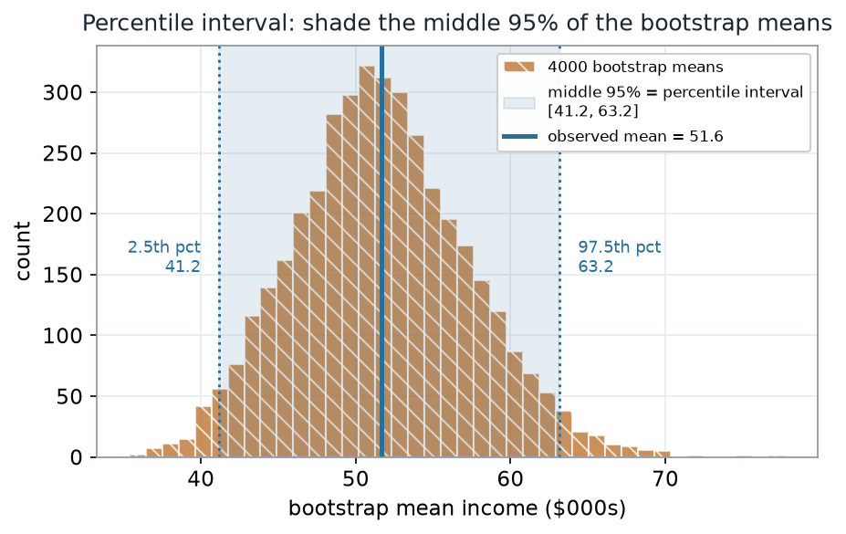
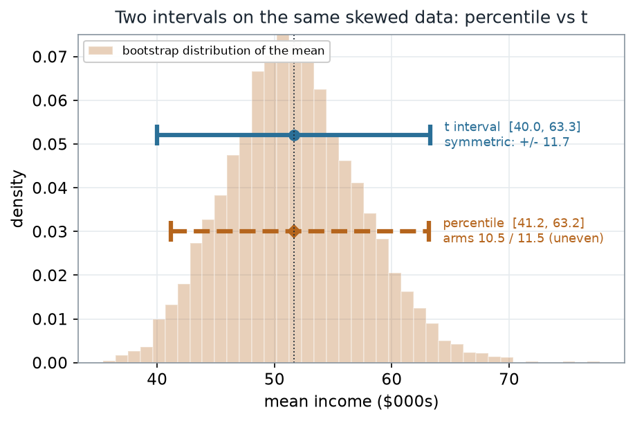
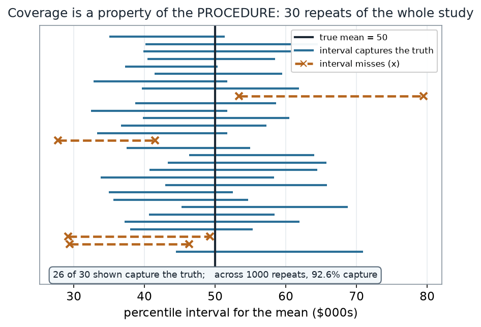

::: {.source-basis}
**Source basis.** Original instructor-authored notes; data is synthetic (40 "household incomes",
in thousands of dollars, drawn from a fixed generator, seed 45206). Open texts are conceptual
companions cited **by section title only** (map-don't-mine); no prose, figures, examples, or
exercises are reproduced. See [Open readings & attribution](../resources/reading-list.qmd).
Ungraded — Blackboard is authoritative for graded work.
:::

::: {.thisweek}
> **This week.** Last week you built a **bootstrap distribution** and read its spread. This week we
> take the natural next step: turn that distribution into a **confidence interval** by reading off
> its tails — the **percentile interval**. Then we ask the two questions that actually matter: how
> does it compare with the textbook $\bar{x} \pm t\,\text{SE}$ interval, and *what does a 95%
> interval really claim?*
:::

## Learning goals {#learning_goals}

By the end of this week you should be able to:

- Construct a **percentile confidence interval** as the middle 95% of a bootstrap distribution
  (here, of the sample **mean**).
- Compare the percentile interval with the **normal/t interval** $\bar{x} \pm t\cdot\text{SE}$ and
  say *why* they differ on skewed data.
- State **coverage** as a **repeated-sampling** property of the procedure — and read it off a
  picture of many intervals.
- Name the misreading "**95% chance the parameter is in *this* interval**," and describe when
  percentile intervals **undercover** (small $n$, strong skew).

## Where we are {#concept_development}

We keep asking the same question: *what is fragile here, and what can we still say?* A single sample
mean is fragile — draw another sample and it moves. Week 5 measured that movement with a bootstrap
distribution. A **confidence interval** packages the movement into a stated range, so that instead
of reporting "the mean is 51.6" we report "the mean is somewhere in a defensible interval, at a
stated confidence level."

Our running example is a batch of **40 synthetic household incomes** (thousands of dollars),
right-skewed. Because the data is skewed, the mean is pulled above the median — but this week the
**mean** is exactly the quantity we want an interval for, so we bootstrap it directly.

### Reading the interval off the bootstrap distribution

The **percentile interval** is almost embarrassingly simple: build the bootstrap distribution of the
statistic, then take the **2.5th and 97.5th percentiles** of those bootstrap values. Everything
between them is the interval. No formula, no normal table, no assumption that the statistic is
Normally distributed — the bootstrap distribution supplies its own shape.

::: {#fig-w06-ci-construction}
![A five-box left-to-right flow: one sample of 40 values; resample and recompute the mean B=4000 times; sort the 4000 bootstrap means; read off the 2.5th and 97.5th percentiles; the percentile interval [41.2, 63.2].](../figures/week-06/w06_ci_construction.png){fig-alt="A five-box left-to-right flow: one sample of 40 values; resample and recompute the mean B=4000 times; sort the 4000 bootstrap means; read off the 2.5th and 97.5th percentiles; the percentile interval [41.2, 63.2]."}

Building a percentile interval: resample and recompute the mean 4000 times, sort the results, and
read off the 2.5th and 97.5th percentiles — here $[41.2,\ 63.2]$.
:::

::: {.notice}
**What to notice.** The interval is nothing more than the **middle 95% of the sorted bootstrap
means**. The pipeline never assumes a distribution shape; it *reads* the shape the resamples produce.
That is the whole appeal of the percentile method.
:::

**The construction, as steps (nonvisual equivalent).**

| Step | What happens |
|---|---|
| 1 | Start with the one observed sample, $x_1,\dots,x_{40}$ |
| 2 | Resample with replacement and recompute the mean, $B = 4000$ times |
| 3 | Sort the 4000 bootstrap means |
| 4 | Read off the 2.5th and 97.5th percentiles → $[41.2,\ 63.2]$ |

## Worked example — the percentile interval {#worked_example}

Running the bootstrap gives 4000 recomputed means. The observed mean is **51.6**; the shaded middle
95% of the bootstrap means is the percentile interval.

::: {#fig-w06-percentile-interval}
{fig-alt="Histogram of 4000 bootstrap means centered near 51.6 thousand dollars; a shaded band marks the middle 95 percent from 41.2 to 63.2, with dotted lines at the 2.5th percentile (41.2) and 97.5th percentile (63.2) and a solid line at the observed mean 51.6."}

Bootstrap distribution of the mean ($B = 4000$); the shaded band is the percentile interval
$[41.2,\ 63.2]$, with the observed mean at 51.6.
:::

::: {.notice}
**What to notice.** The band is the **middle 95%** of the bootstrap means — 2.5% of the resampled
means fall below 41.2 and 2.5% above 63.2. The interval is not centered by a formula; its edges are
just two percentiles of a lightly right-skewed pile, so the upper arm (11.5) is a touch longer than
the lower arm (10.5).
:::

**Percentile read-out (nonvisual equivalent).**

| Quantity | Value |
|---|---|
| Observed mean | 51.6 ($000s) |
| Bootstrap SE of the mean | 5.62 |
| Percentile interval (2.5th, 97.5th) | [41.2, 63.2] |
| Lower arm · upper arm (about the mean) | 10.5 · 11.5 |
| Resamples ($B$) | 4000 |

The R you would run is short — and, as always, it contains **no plotting**; the picture is downstream:

```r
# Schematic: the named data objects are the sample(s) described in the text above; this illustrates the analysis, not a self-contained runnable block.
# percentile interval for the MEAN of a skewed sample
set.seed(45206)
x    <- income                       # the 40 observed incomes ($000s)
B    <- 4000
boot <- replicate(B, mean(sample(x, size = length(x), replace = TRUE)))

quantile(boot, c(0.025, 0.975))      # the percentile interval
sd(boot)                             # bootstrap standard error of the mean
```

## Percentile vs the t interval

The textbook interval is $\bar{x} \pm t_{0.975,\,n-1}\cdot\text{SE}$, with $\text{SE} = s/\sqrt{n}$.
It is **symmetric** by construction: the same distance left and right of $\bar{x}$. The percentile
interval is free to be **asymmetric**. On skewed data the two therefore disagree — subtly here, but
in a way that matters as skew grows.

::: {#fig-w06-pct-vs-t}
{fig-alt="The bootstrap distribution of the mean drawn faintly, with two horizontal interval bars: a solid teal t interval from 40.0 to 63.3, symmetric about the mean, and a dashed ochre percentile interval from 41.2 to 63.2 with uneven arms 10.5 and 11.5."}

The same skewed data, two intervals: the $t$ interval $[40.0,\ 63.3]$ (symmetric, $\pm 11.7$) and the
percentile interval $[41.2,\ 63.2]$ (asymmetric arms $10.5 / 11.5$).
:::

::: {.notice}
**What to notice.** The $t$ interval reaches down to **40.0** because it is forced to be symmetric —
it spends the same 11.7 on each side of $\bar{x}$. The percentile interval only reaches **41.2** on
the low side, because the bootstrap means don't extend as far left as a symmetric rule assumes. The
percentile method **lets the data's shape set the shape of the interval**; the $t$ method imposes a
symmetric one.
:::

**Two intervals side by side (nonvisual equivalent).**

| Interval | Lower | Upper | Half-width / arms | Symmetric? |
|---|---|---|---|---|
| $t$: $\bar{x} \pm t\cdot\text{SE}$ ($t_{0.975,39}=2.0227$) | 40.0 | 63.3 | $\pm 11.7$ | yes |
| Percentile (2.5th, 97.5th) | 41.2 | 63.2 | 10.5 / 11.5 | no |

## What "95% confidence" actually means

Here is the honest question: what does "95%" attach to? Because our data is synthetic, we know the
**true** mean is exactly **50**, so we can do the one experiment you can never do in practice — repeat
the whole study many times and watch the intervals.

::: {#fig-w06-coverage}
{fig-alt="Thirty horizontal percentile intervals stacked vertically, each from a fresh simulated sample, with a vertical line at the true mean 50; twenty-six intervals cross the line (solid, capture) and four miss it (dashed with an x marker)."}

Coverage as a property of the **procedure**: 30 repeats of the whole study. Here 26 of 30 intervals
capture the true mean (50); across 1000 repeats, 92.6% capture.
:::

::: {.notice}
**What to notice.** Each repeat produces a *different* interval, because each starts from a different
sample. "**95% confidence**" is a promise about the **long-run share of intervals that capture the
truth**, not about any single one. Read that share off the many intervals — it is a property of the
recipe, seen only by repeating the recipe.
:::

**Coverage read-out (nonvisual equivalent).**

| Quantity | Value |
|---|---|
| True mean (known, synthetic) | 50 ($000s) |
| Repeats simulated | 1000 |
| Intervals capturing the truth | 92.6% |
| Shown in the figure | 26 of 30 capture |

## A common mistake

::: {.misconception}
**"A 95% interval means there's a 95% chance the mean is in *this* interval."** Once you have a
particular interval, the mean is either inside it or not — the probability is 0 or 1, we just don't
know which. The **95%** describes how often the *procedure* captures the truth across many samples,
not the odds for your one interval. And the promise is not automatic: for the **mean of skewed data
with small $n$**, the percentile interval **undercovers** — here it captured only **92.6%** of the
time, short of the nominal 95%.
:::

::: {#fig-w06-ci-misread}
{fig-alt="Twenty-five percentile intervals against a fixed vertical line at the true mean 50; two intervals miss the line and are highlighted in dashed ochre with x markers, while one interval labeled THIS study's interval is drawn in bold at the top; a caption notes the 95% is the long-run capture rate of the procedure."}

The misread, pictured: the truth (50) is **fixed**; each interval either contains it or not. Of these
25 intervals, 2 miss. "THIS study's interval" is just one draw — the 95% is the procedure's capture
rate, not a probability for it.
:::

::: {.notice}
**What to notice.** The vertical truth line does not move; the **intervals** do. Highlighting the
misses makes the point concrete: you cannot assign "95%" to the single bold interval at the top,
because it is fixed. The confidence level lives in the **collection**, not the individual.
:::

**Misread read-out (nonvisual equivalent).**

| Quantity | Value |
|---|---|
| Intervals shown | 25 |
| Intervals missing the fixed truth | 2 |
| Probability the truth is in a *given* fixed interval | 0 or 1 (unknown) |

## Check your understanding (ungraded)

1. In one sentence, describe how to build a percentile interval from a bootstrap distribution — what
   two numbers do you read off, and from what?
2. The $t$ interval here was $[40.0, 63.3]$ and the percentile interval was $[41.2, 63.2]$. Explain
   why the low ends differ, in terms of the **shape** of the bootstrap distribution.
3. A classmate says "the 95% interval $[41.2, 63.2]$ has a 95% chance of containing the mean."
   Rewrite the claim so it is correct.
4. Coverage came out **92.6%**, below the nominal 95%. Name the two features of this problem that
   push the percentile interval to undercover, and say what you might do about it.

## Reading guide

- **IMS — *Bootstrap confidence intervals*** — a conceptual companion to reading an interval off a
  bootstrap distribution; read for the intuition, then check it against the pictures above.
- **ModernDive — *Bootstrapping and confidence intervals*** — reinforces the percentile method and
  the repeated-sampling meaning of a confidence level.
- **OpenIntro Statistics 4e — *Confidence intervals*** — the $\bar{x}\pm t\cdot\text{SE}$ interval we
  contrast against, for a common reference point.
- **NIST/SEMATECH e-Handbook — *Bootstrap uncertainty*** — an instructor reference on bootstrap
  interval methods and their limits (cited, not reproduced).

## Accessibility notes

Mathematics is live text ($\bar{x} \pm t\cdot\text{SE}$ renders as MathML, not an image). Every
figure carries an alt line stating its message, a "what to notice" reading, and an adjacent
data-summary table, so each point survives without the picture. Intervals are distinguished by
**linestyle and marker** (solid = the $t$ interval / a capturing interval; dashed with an "×" = the
percentile interval / a missing interval) and by labels, not color alone. A clean lint and a clean
render are evidence; the rendered assistive-technology review is a human step.

## Assessment (descriptive only)

This week contributes learning evidence toward *constructing and reading a percentile confidence
interval* and *stating what a confidence level claims*. That is the **shape** only; the actual graded
prompts, weightings, and due dates live in Blackboard.

::: {.boundary-note}
**Public vs. graded.** These are public, ungraded notes and practice. Graded prompts, keys, rubrics,
weightings, and due dates live in **Blackboard Ultra**, which governs.
:::

## Looking ahead

We now have two ways to make an interval — a formula and a resample — and a clear-eyed view of what
either one claims. Next week we leave the mean behind and return to **ranks**, building
distribution-free procedures for one-sample and paired data where even the bootstrap's assumptions
are more than we want to make.
